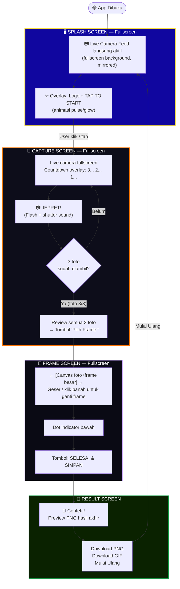

# 🎞️ Flowchart UI Photobooth — Snapkoms

> Konsep: **Ubah dari website → experience seperti mesin photobooth fisik**
> Layar selalu fullscreen, kamera selalu visible, navigasi seperti kiosk.

---

## 🗺️ User Flow Final (Photobooth App Mode)

---

## 📋 Penjelasan Per Screen

### 1. 🖥️ SPLASH SCREEN (`step: 'IDLE'`)

**Konsep:** Layar "standby" seperti mesin photobooth fisik — kamera langsung aktif dari awal.

| Elemen | Deskripsi |
|--------|-----------|
| **Background** | Live camera feed langsung aktif, fullscreen, di-mirror |
| **Overlay** | Vignette gelap + efek scanlines retro |
| **Logo** | SNAPKOMS + icon kamera di tengah atas |
| **CTA Utama** | Tombol besar `TAP TO START` bulat dengan animasi pulse rings |
| **Info strip** | "📷 3 FOTO · 🖼️ PILIH FRAME · ⬇️ DOWNLOAD" |

---

### 2. 📸 CAPTURE SCREEN (`step: 'CAMERA_SETUP'`)

**Konsep:** Live camera mengisi **100% layar**. Semua UI kontrol mengapung di atas kamera sebagai overlay.

| Elemen | Posisi | Deskripsi |
|--------|--------|-----------|
| **Progress badge** | Top-left | `FOTO 1/3`, `FOTO 2/3`, dst. |
| **Flip button** | Top-right | Toggle mirror kamera |
| **Countdown** | Center | Angka besar 3→2→1 + teks "BERPOSE!" |
| **Flash Effect** | Fullscreen | White flash saat foto diambil |
| **Thumbnail strip** | Bottom overlay | 3 slot foto kecil (kosong → terisi) |
| **Filter strip** | Bottom overlay | ORIGINAL, DARK ROOM, RETRO, FILM, FLASH, NOIR |
| **Shutter button** | Bottom overlay | Tombol putih bulat besar |
| **Review actions** | Bottom overlay | "Ulangi" + "Simpan" saat review 1 foto |
| **Confirm button** | Bottom overlay | "Pilih Frame!" saat semua 3 foto selesai |
| **Gradient scrim** | Bottom | Gradien hitam transparan agar UI terbaca |

> ✅ **Tidak ada dark bar terpisah** — kamera full layar, semua UI float di atasnya.

---

### 3. 🎨 FRAME SCREEN (`step: 'FRAME_COMPOSITOR'`)

**Konsep:** Fullscreen gelap. Canvas foto strip besar sebagai carousel — **canvas itu sendiri IS the carousel item**.

| Elemen | Deskripsi |
|--------|-----------|
| **Top bar** | Judul "Pilih Frame" + nama frame aktif + counter `X/5` |
| **Canvas besar** | Foto strip dengan frame aktif, memenuhi area tengah |
| **Panah ← →** | Navigasi antar frame (overlay di kiri-kanan canvas) |
| **Swipe support** | Geser kiri/kanan di mobile |
| **Dot indicator** | Titik-titik di bawah canvas (yang aktif lebih panjang/kuning) |
| **Tombol CTA** | `SELESAI & SIMPAN` kuning di paling bawah |

> ❌ **Tidak ada:** filter foto, teks watermark input, card info frame, panel samping
> ✅ Watermark default otomatis: `SNAPKOMS MEMORIES`

---

### 4. 🎉 RESULT SCREEN (`step: 'RESULT'`)

**Konsep:** Layar perayaan + download.

| Elemen | Deskripsi |
|--------|-----------|
| **Confetti** | Animasi confetti otomatis saat masuk |
| **Preview PNG** | Foto strip hasil akhir ditampilkan |
| **Preview GIF** | Animated GIF boomerang (diproses async) |
| **QR Code** | Muncul setelah upload selesai (untuk scan di HP) |
| **Aksi** | Download PNG, Download GIF, Foto Lagi |

---

## 🔄 Keputusan Desain Final

| Keputusan | Status | Alasan |
|-----------|--------|--------|
| Hapus SETUP screen (pilih 3/4 foto) | ✅ Done | Flow lebih cepat & simpel |
| Hardcode 3 foto | ✅ Done | Konsistensi semua template |
| Hapus fitur stiker | ✅ Done | Menyederhanakan UX |
| Hapus filter foto di Frame screen | ✅ Done | Simpel, filter sudah ada di Capture |
| Hapus input teks watermark | ✅ Done | Pakai default otomatis |
| Frame picker = carousel canvas | ✅ Done | Canvas langsung jadi item carousel |
| Semua kontrol Capture = overlay | ✅ Done | Kamera full layar, UI di atas |
| Kamera aktif sejak splash | ✅ Done | User langsung engaged |

---

## 🛠️ Status File

| File | Status | Keterangan |
|------|--------|-----------|
| `components/SplashScreen.tsx` | ✅ Done | Live cam fullscreen + TAP TO START |
| `components/CameraView.tsx` | ✅ Done | Fullscreen cam, semua UI sebagai overlay |
| `components/FrameCompositor.tsx` | ✅ Done | Canvas carousel fullscreen, no filter/watermark |
| `lib/frameTemplates.ts` | ✅ Done | Semua template `photoCount: 3` |
| `app/page.tsx` | ✅ Done | Landing page dihapus, flow kiosk |
| `app/globals.css` | ⬜ Pending | Opsional: lock scroll kiosk mode |
